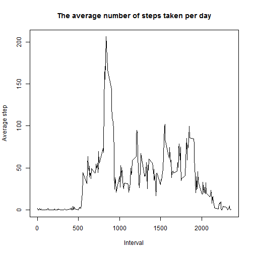
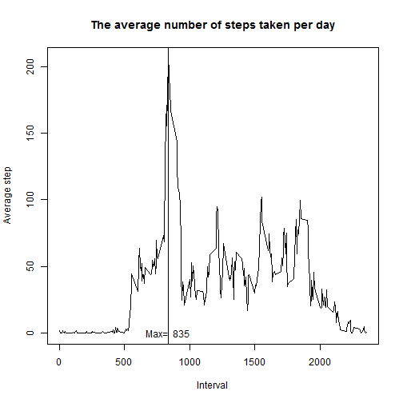
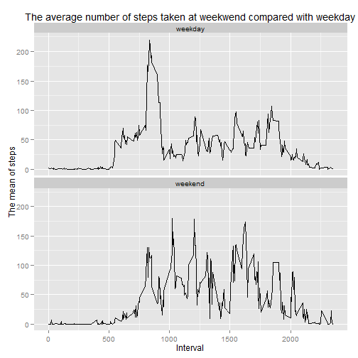

# Reproducible Research: Peer Assessment 1
## Name: Phung Xuan Huynh
<h2> Occupation: Teaching Assistant at University of Technical Education Hochiminh City, Vietnam</h2>
==============================================================================================


## Loading and preprocessing the data

```r
#First, please set current directory working in your computer: setwd()
activity <- read.csv("activity.csv")
summary(activity)
```

```
##      steps               date          interval   
##  Min.   :  0.0   2012-10-01:  288   Min.   :   0  
##  1st Qu.:  0.0   2012-10-02:  288   1st Qu.: 589  
##  Median :  0.0   2012-10-03:  288   Median :1178  
##  Mean   : 37.4   2012-10-04:  288   Mean   :1178  
##  3rd Qu.: 12.0   2012-10-05:  288   3rd Qu.:1766  
##  Max.   :806.0   2012-10-06:  288   Max.   :2355  
##  NA's   :2304    (Other)   :15840
```
## What is mean total number of steps taken per day?
1. Preprocessing that return the steps counter, mean of step, median of step per day

```r
library(ggplot2)
```

```
## Need help? Try the ggplot2 mailing list: http://groups.google.com/group/ggplot2.
```

```r
countSteps <- aggregate(steps ~ date, subset(activity, !is.na(steps)), sum)  
```
2. A histogram demonstrates the total number of steps taken each day

```r
qplot(data=countSteps,x=steps)
```

```
## stat_bin: binwidth defaulted to range/30. Use 'binwidth = x' to adjust this.
```

 
3. Calculate and report the mean and median total number of steps taken per day

```r
meanStep <- mean(countSteps$steps)
medianStep <- median(countSteps$steps)
meanStep
```

```
## [1] 10766
```

```r
medianStep
```

```
## [1] 10765
```

## What is the average daily activity pattern?
1. Make time series plot

```r
intervalMean <- aggregate(steps ~ interval,subset(activity, !is.na(steps)), mean)

plot(x = intervalMean$interval, y=intervalMean$steps, type="l",xlab="Interval"
     ,main="The average number of steps taken per day",
     ylab="Average step")
```

 
2. Maximum number of step that corresponsed with 5- interval

```r
maxStep <- max(intervalMean$steps)
intervalMax <- subset(intervalMean, steps== maxStep)$interval
plot(x = intervalMean$interval, y=intervalMean$steps, type="l",xlab="Interval"
     ,main="The average number of steps taken per day",
     ylab="Average step")
abline(v=intervalMax)
text(x=intervalMax,y= 0,paste("Max= ", intervalMax))
```

 

## Imputing missing values
1. Total number of missing values in dataset

```r
dim(subset(activity, is.na(steps)))[1]
```

```
## [1] 2304
```

2. Impute the missing value by filling the average step of this 5 minute interval 

```r
activityImputed <- activity
intervalMean <- aggregate(steps ~ interval,subset(activityImputed, !is.na(steps)), mean)
n <- dim(activityImputed)[1]
for (i in 1:n)  {
  if (is.na(activity[i,1]))
    activityImputed[i,1] <- subset(intervalMean,interval == activityImputed[i,3])[1,2]
}
```
3. Procedure histogram that depicts the total number of steps taken each day; furthermore report new mean, and new median

```r
countStepsNew <- aggregate(steps ~ date, activityImputed, sum) 
qplot(data=countStepsNew,x=steps)
```

```
## stat_bin: binwidth defaulted to range/30. Use 'binwidth = x' to adjust this.
```

 

```r
meanStepNew <- mean(countStepsNew$steps)
medianStepNew <- median(countStepsNew$steps)
meanStepNew
```

```
## [1] 10766
```

```r
medianStepNew
```

```
## [1] 10766
```
In conlusion, the new dataset that imputed shows histogram like the original as well as means are equal but new median is slightly greater than the previous

## Are there differences in activity patterns between weekdays and weekends?
1. Create new factor variable in datase. I assume that weekend is Sunday

```r
weekday <- c("Monday","Tuesday","Wednesday","Thursday","Friday","Saturday","Sunday")
#weekend <- c("Saturday","Sunday")
#which(weekday == weekdays(as.Date(activityImputed[1,2])))
#weekdays(as.Date(countStepsNew$date))
activityImputed$day <- NULL

n <- dim(activityImputed)[1]
for (i in 1:n)  {
  day <- which(weekday == weekdays(as.Date(activityImputed[i,2])))
  #print(weekdays(as.Date(activityImputed[i,2])))
  #print(day)
  if (day <= 6) {
    activityImputed[i,4] = ("weekday")
  }
  else{
    activityImputed[i,4] = ("weekend")
  }
}

activityImputed <-  transform(activityImputed, day = factor(V4))
```
2. Make the time series plot to compare the activity on weekday with weekend

```r
library(dplyr)
```

```
## 
## Attaching package: 'dplyr'
## 
## The following objects are masked from 'package:stats':
## 
##     filter, lag
## 
## The following objects are masked from 'package:base':
## 
##     intersect, setdiff, setequal, union
```

```r
weekday_group <- group_by(activityImputed, interval, day)
activity_weekday <- summarise(weekday_group,
                                 mean_steps = mean(steps),
                                 n=n())

qplot(data=activity_weekday ,y= mean_steps, x=interval,geom = "line",
      main="The average number of steps taken at weekwend compared with weekday",
      xlab="Interval",
      ylab="The mean of steps") + 
  facet_wrap(~day, ncol=1, nrow=2)
```

 


